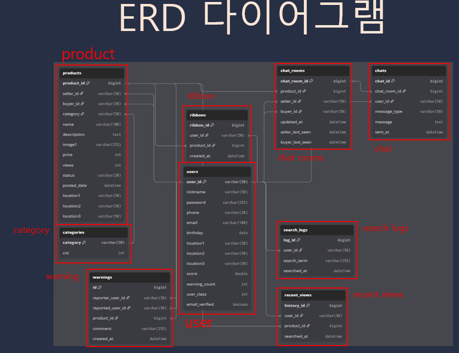
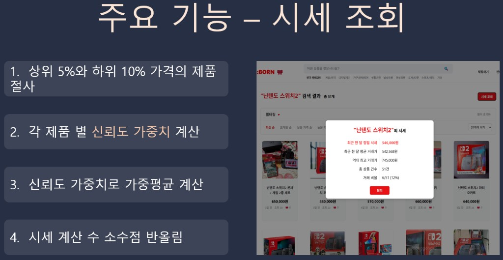
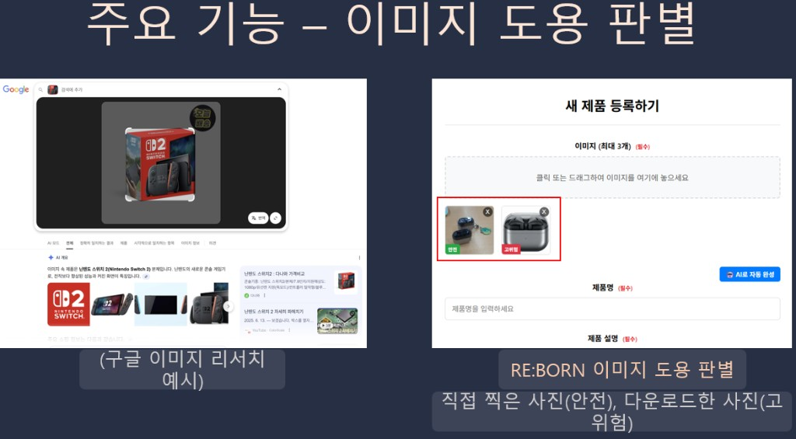
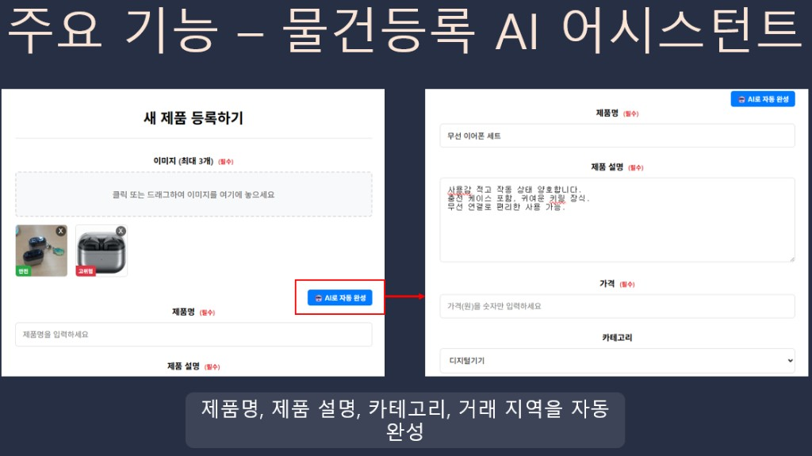
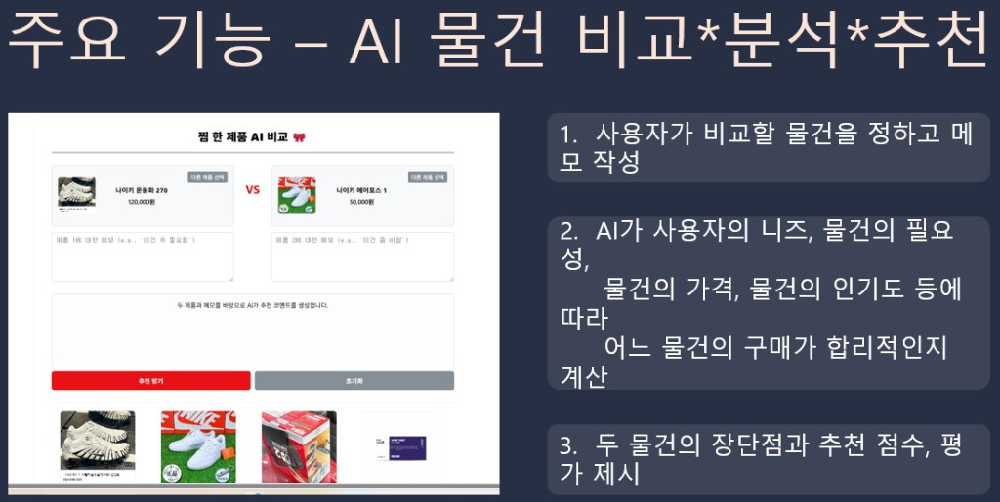
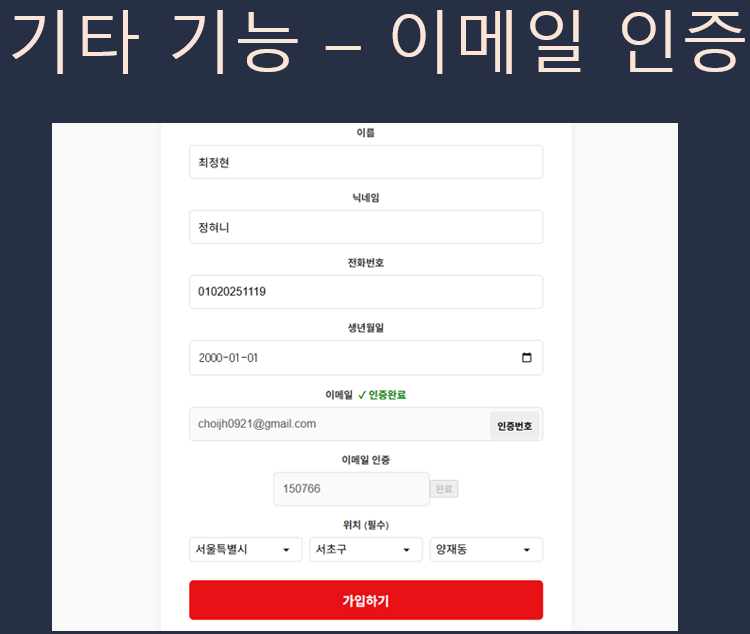
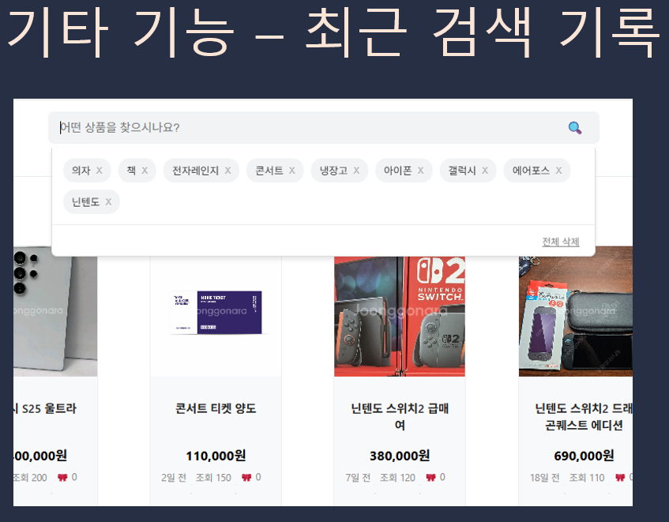
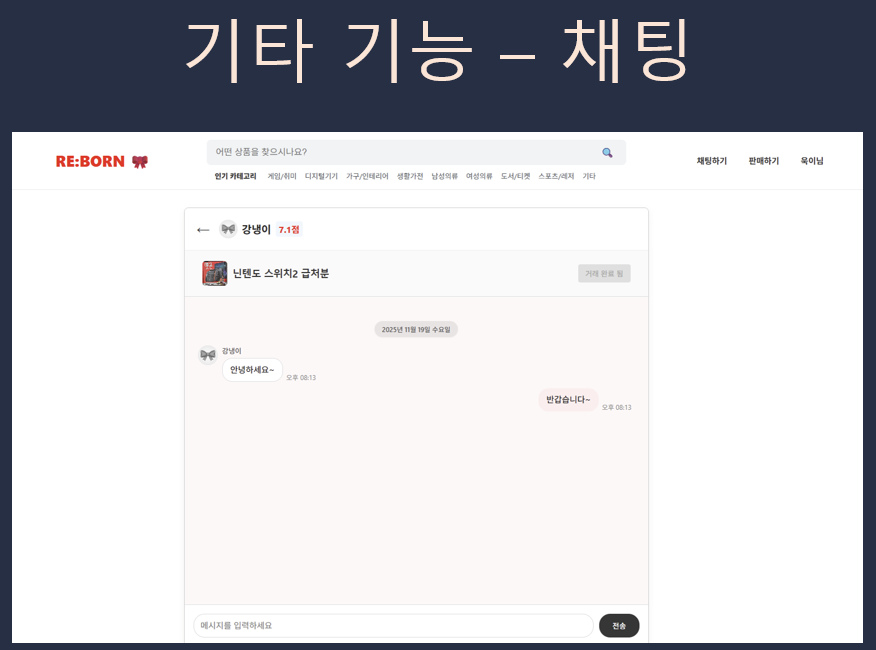

# RE:BORN Frontend

### RE:BORN 개요

현대사회에서 온라인 쇼핑의 편리함은 불필요한 소비를 촉진시켜 사용하지 않게 된 물건들이 쌓이고, 이로 인해 많은 물건들이 폐기되어 사회적인 문제가 초래되고 있습니다.  
또한, 기존의 중고거래 플랫폼들은 사용자 편의성 부족, 신뢰성 문제, 사기 거래, 제품 도용, 부정확한 시세 산출 등 여러 한계점을 가지고 있습니다.

**RE:BORN**은 *버려지는 물건에 새 생명을 불어넣는다*는 의미를 담고 있으며, 중고 물품의 거래를 통해 **지속 가능한 소비 문화**를 만드는 것을 목표로 합니다.  
`리본(RE:BORN)`은 사람과 사람을 다시 묶어주는 의미도 가지고 있어, **사용자 간 신뢰와 소통을 강화하는 중고거래 플랫폼**을 지향합니다.

이 프로젝트는 사용자가 **신뢰할 수 있고 안전하게 거래할 수 있는 환경**을 제공하고, **AI 기반 맞춤형 서비스**를 통해 더 효율적이고 편리한 중고거래 경험을 제공하는 것을 목표로 합니다.

### 설계의 주요 포인트

- **정확한 시세 분석**: 결제 평가와 신뢰도를 반영한 **가중평균**으로 시세를 분석하고 가격을 제시
- **이미지 도용/사기 방지**: Google Cloud Vision API로 **이미지 도용 및 유사도 검증**
- **등록 편의성 향상**: 이미지 업로드 시 AI가 **제품명, 설명, 카테고리**를 자동 제안
- **AI 비교/추천**: 찜한 제품을 비교하고 **가격, 필요성, 인기 등**을 종합해 합리적인 구매를 추천
- **신뢰 기반 거래**: 유저 점수를 통해 상대방 **신뢰도**를 확인하고 안전한 거래 환경 제공
- **정교한 검색/정렬**: 카테고리, 가격대, 판매상태, 지역 필터와 **시간·가격·조회수 정렬** 지원
- **개인화 마이페이지**: 판매/구매 내역, 최근 본 제품, 찜한 제품 등 **개인화된 관리 기능**

### 응용 분야

- AI 기반 중고거래 플랫폼 서비스
- 가격 시세 분석 및 예측 플랫폼
- 지역 커뮤니티형 순환 소비 플랫폼
- 온라인 중고 마켓 통합 관리 솔루션
- 지속 가능한 소비문화 조성을 위한 **교육/캠페인 플랫폼**
- 기부 및 재사용 연계 **사회 공헌 서비스**
- 이미지 유사도 판별 및 도용 방지 시스템
- 사용자 맞춤형 상품 추천 시스템
- 친환경 재사용(Re-use) 유통 서비스
- 기업/기관용 중고 자산 관리 시스템

### 사용 기술

- **개발 환경**: Windows 11  
- **개발 도구**: IntelliJ, VS Code, Git, GitHub, JDK 21, Gradle, Lombok  
- **백엔드**: Spring Boot, Spring Web, Spring Security, Spring Data JPA, Querydsl, JWT, Spring Boot Mail, Caffeine Cache, OpenAI API, Google Vision AI  
- **프론트엔드**: React.js, JavaScript, HTML, CSS  
- **데이터베이스**: MySQL  

### 주요 화면 캡쳐

#### ERD

#### 핵심 기능 화면

- **시세 조회**

  

- **이미지 도용 판별**

  

- **물건등록 AI 어시스턴트**

  

- **AI 물건 비교·분석·추천**

  

#### 기타 주요 화면

- **이메일 인증**

  

- **최근 검색 기록**

  

- **최근 본 상품 기록**

  

- **채팅**

  

### 추가 문서

- **시연 화면/기능 캡쳐 전체 모음**: `docs/DEMO.md`

## 로컬 실행

프로젝트는 Create React App 기반입니다.

## Available Scripts

In the project directory, you can run:

### `npm start`

Runs the app in the development mode.\
Open [http://localhost:3000](http://localhost:3000) to view it in your browser.

The page will reload when you make changes.\
You may also see any lint errors in the console.

### `npm test`

Launches the test runner in the interactive watch mode.\
See the section about [running tests](https://facebook.github.io/create-react-app/docs/running-tests) for more information.

### `npm run build`

Builds the app for production to the `build` folder.\
It correctly bundles React in production mode and optimizes the build for the best performance.

The build is minified and the filenames include the hashes.\
Your app is ready to be deployed!

See the section about [deployment](https://facebook.github.io/create-react-app/docs/deployment) for more information.

### `npm run eject`

**Note: this is a one-way operation. Once you `eject`, you can't go back!**

If you aren't satisfied with the build tool and configuration choices, you can `eject` at any time. This command will remove the single build dependency from your project.

Instead, it will copy all the configuration files and the transitive dependencies (webpack, Babel, ESLint, etc) right into your project so you have full control over them. All of the commands except `eject` will still work, but they will point to the copied scripts so you can tweak them. At this point you're on your own.

You don't have to ever use `eject`. The curated feature set is suitable for small and middle deployments, and you shouldn't feel obligated to use this feature. However we understand that this tool wouldn't be useful if you couldn't customize it when you are ready for it.

## Learn More

You can learn more in the [Create React App documentation](https://facebook.github.io/create-react-app/docs/getting-started).

To learn React, check out the [React documentation](https://reactjs.org/).

### Code Splitting

This section has moved here: [https://facebook.github.io/create-react-app/docs/code-splitting](https://facebook.github.io/create-react-app/docs/code-splitting)

### Analyzing the Bundle Size

This section has moved here: [https://facebook.github.io/create-react-app/docs/analyzing-the-bundle-size](https://facebook.github.io/create-react-app/docs/analyzing-the-bundle-size)

### Making a Progressive Web App

This section has moved here: [https://facebook.github.io/create-react-app/docs/making-a-progressive-web-app](https://facebook.github.io/create-react-app/docs/making-a-progressive-web-app)

### Advanced Configuration

This section has moved here: [https://facebook.github.io/create-react-app/docs/advanced-configuration](https://facebook.github.io/create-react-app/docs/advanced-configuration)

### Deployment

This section has moved here: [https://facebook.github.io/create-react-app/docs/deployment](https://facebook.github.io/create-react-app/docs/deployment)

### `npm run build` fails to minify

This section has moved here: [https://facebook.github.io/create-react-app/docs/troubleshooting#npm-run-build-fails-to-minify](https://facebook.github.io/create-react-app/docs/troubleshooting#npm-run-build-fails-to-minify)
